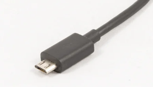
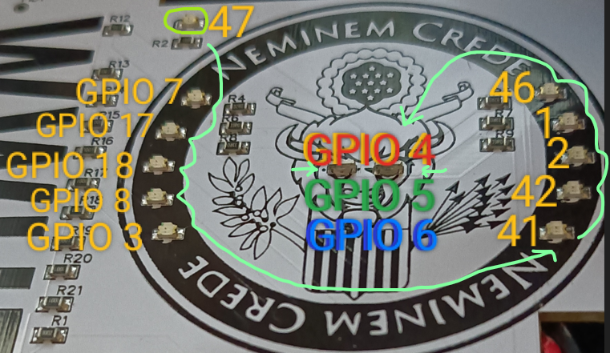

# Programming the WWHF 2023 Badge
A guide to programming one of the badges received at Wild-West Hackin' Fest of 2023. A lot of good information on the badge for this year can be found on the official Wild-West Hackin' Fest website and Discord.

The badge itself could be used to scan different locations throughout the event site, and once all tokens were collected I think the winner would obtain a flag to submit as part of the ctf. Much appreciation goes out to those that arranged and participated in the event at Deadwood this year, it was very enjoyable and enlightening.

Note that this isn't a sponsored or endorsed writeup of the badge, and this is just some advice and knowledge I thought I could share with others since I had one to mess with.

<h1> Badge Features </h1>

- x14 Controllable LEDs (11 individual + 3 for RGB, the "eyes")
- x2 User Configurable Buttons
- x1 ESP32-S3 WiFi & Bluetooth [SoC](https://www.howtogeek.com/769198/what-is-a-system-on-a-chip-soc/)
- x1 RFID Reader RFID-RC522 With a [SPI](https://www.analog.com/en/analog-dialogue/articles/introduction-to-spi-interface.html) [connection](https://docs.espressif.com/projects/arduino-esp32/en/latest/api/spi.html) to the ESP32-S3
- x1337 Cool Designs + Flashy

*TODO: Map the input pins and identify the bus (and [if it's SPI, I2C or UART](https://microcontrollerslab.com/rc522-rfid-reader-pinout-arduino-interfacing-examples-features/)) used on the ESP32 with the Reader*

## What's Needed
### Hardware
- WWHF 2023 Badge you want to program
- USB A to Micro-B Sync/Data Cable, *one of these:*



### Software
- [Arduino IDE](https://www.arduino.cc/en/software) or [Espressif IDE / Tools](https://dl.espressif.com/dl/esp-idf/)
### Things to Know
#### The Dangerous Stuff
##### 🔋 The Battery
- The Badge comes with a Lithium battery you attach to the backside, and then plug-in to the badge through a hole. It's important to note at this point that this is an exposed Lithium battery. Lithium batteries can violently burst into flames if they are over-stressed (bent), punctured or over-charged. And when it happens they smell truly awful, and the fumes probably cause cancer or something, certainly not any good things come from it. It's good to observe Lithium battery etiquette, and avoid disturbing them in their natural habitat.
##### 🎚️ The USB / Battery Power Selector
- On the side of the badge there are two switches. One controls the power rails for the badge, selecting either USB power or battery power. It it is best practice to make sure you select the correct one. 
- If you are programming the badge and powering it via USB, make sure to select this on the switch.
- If you are wearing or displaying the badge and want to use the battery, then flip the switch for that purpose, making sure to switch it back if you'll plug it in over USB. Forgetting to select the proper rail on the switch might cause it not to function as expected, or might even be a little dangerous at worst so it's best to pay close attention to what's selected when using it. The other switch is simply a power on/off switch.
##### 🚫 Avoid Programming These Pins
- One thing you should know is that the USB port uses two of the electrical pins on the ESP32-S3. When you program it **make sure that your code does not use GPIO19 or GPIO20 for anything**, as these are the USB Data pin connections (D+ and D-). If you reprogram the badge with code that tries to use these pins for something else, it will brick the USB connection for the badge, and you will be unable to reprogram it. While it is possible to recover from this *with a 1k-ohm resistor and careful hands...* it is not trivial, and it's best to just avoid bricking it in the first place like me.
#### The Cool Stuff
##### 📶 Bluetooth & WiFi Capable
- The ESP32-S3 module on this badge is capable of many things including the features documented in the official Espressif ESP32-S3 Series [datasheet here](https://www.espressif.com/sites/default/files/documentation/esp32-s3_datasheet_en.pdf). This provides a good overview of the System-on-Chip (SoC) and it's features which include WiFi and Bluetooth capabilities.
##### 🏴‍☠️ Hackable
- Many of the electrical pins are capable of multiple functions, depending on how you write a program to use them. You can use certain groups of pins as a bus for data transmission (UART, I2C, or something else), or write code to manipulate individual pins however you please (GPIO).
##### 📳 Includes an RFID Reader
- One of the SPI interfaces on the badge ESP32 is attached to the green RFID Reader module RFID-RC522 on the back, which you should be able to control on one of the SPI interfaces. I haven't done this yet, but an example I found [here could be useful for that](https://esp32io.com/tutorials/esp32-rfid-nfc-relay)
### Before continuing
If you prefer to dive in with programming the Arduino, go to "Installation: Quick Steps", and then see "Programming Quick Steps:" for SimpleHello.ino and SimpleLeds.ino. Otherwise keep reading.
## 🆕 Set up the Programming Environment

There are a few ways to program the ESP32. The two main ways I am familiar with are directly (using the original Espressif tools), or by using the Arduino IDE.

If you are more familiar with using the command line, compiling projects with your own editor/IDEs, and you're comfortable learning a lot about the ESP32 SoC internals in detail (reading a lot of datasheets and docs!), you might consider using the [Espressif tools](https://docs.espressif.com/projects/esp-idf/en/latest/esp32s3/get-started/index.html#introduction) , namely `esp-idf`, used as command `idf.py` once installed. This collection of tools will give you more control over your device, with (*allegedly*) less "bloat" to your code. It also contains an "examples" directory for sample code projects you can simply copy and build / upload all with `idf.py`. 

With esp-idf tools installed, you can open the configured console and run commands for various tasks:
- `cd` to a valid project folder, and run commands:
  - `idf.py menuconfig` to configure the project
  - `idf.py build` to build project
  - `idf.py flash` to build and flash the project to the ESP32
  - `idf.py monitor` to make a serial connection to the ESP32

- Dump a backup copy of the raw data from the ESP32 flash storage:
  - `esptool.py --port COM4 --baud 115200 read_flash 0 ALL flash_contents.img`

- Restore a raw dump back to the ESP32:
  - `esptool.py --port COM4 --baud 115200 write_flash -fm qio 0 flash_contents.img`

- Read information on dumped raw data:
  - `esptool.py image_info --version 2 flash_contents.img`

While there are possibly some performance benefits and lots to learn and do using these tools, sometimes the learning curve can be a bit high, and so it is not necessarily recommended.

For those just starting off, [Arduino IDE](https://www.arduino.cc/en/software) is a better and more approachable option, and is the process I'll cover below. 
### Thoughts on Arduino IDE
#### Long Rant you Can Skip
Before trying to program anything, you need a place to write your code, and a tool that will check, compile and then upload the code as a compiled program (binary file) to the ESP32.

The Arduino IDE has been around for a long time, and is an easy choice for programming [supported Arduino devices](https://en.wikipedia.org/wiki/List_of_Arduino_boards_and_compatible_systems) *(or devices designed like them, such as the badge)*. The software features an editor, and a behind-the-scenes suite of tools and libraries integrated into it for editing, validating, compiling and uploading your code to a specified device, and even communicating with the device over a serial port connection. 

It comes with the [Arduino libraries or API](https://docs.arduino.cc/learn/starting-guide/getting-started-arduino#arduino-api-1), which abstract away the complicated details of supported hardware and their underlying libraries which might be unique to each one. The libraries make it easier to just *do* things you want to do in code in a more repeatable and easily understandable way, without getting too bogged down in the technicalities of the specific Microcontroller or SoC you're programming (lots of [tutorials](https://www.arduino.cc/en/Tutorial/HomePage), with [forums](https://forum.arduino.cc/) and generally much easier to learn).

To make a comparison, we could look at something as simple as turning an LED on for one second and then off for one second (on > pause > off > pause).

Using the Espressif tools (`esp-idf`) and their libraries / API will make that code look something like the snippet below:
```C++
// Turn ON (1) the LED pin #47...
gpio_set_level(47, 1);

// Pause one second (1000 ms)
vTaskDelay(1000 / portTICK_PERIOD_MS);

// Turn OFF (0) the LED pin #47..
gpio_set_level(47, 0);

// Pause one second (1000 ms)
vTaskDelay(1000 / portTICK_PERIOD_MS);
```

In the Arduino IDE those same instructions look like this:
```C++
// Set LED_PIN_47 "HIGH"
digitalWrite(47, HIGH);

// Pause one second (1000 ms)
delay(1000);

// Set LED_PIN_47 "LOW"
digitalWrite(47, LOW);

// Pause one second (1000 ms)
delay(1000);
```
Not shown is the configuration code for setting up these pins before using them, which can also be very different and more involved using the Espressif tools and libraries (like using [FreeRTOS](https://docs.espressif.com/projects/esp-idf/en/latest/esp32/api-reference/system/freertos.html)). You will need to have a strong understanding of the C programming language to begin navigating and utilizing Espressif tools & libraries. 

The good news is if you don't know or aren't at a strong level of understanding with C or C++ programming languages, the book "[Programming From the Ground Up](https://www.amazon.com/Programming-Ground-Up-Jonathan-Bartlett/dp/1616100648)" by Jonathan Bartlett is a [good book to check out](https://download-mirror.savannah.gnu.org/releases/pgubook/ProgrammingGroundUp-1-0-booksize.pdf), along with [many](https://www.youtube.com/watch?v=KnvbUiSxvbM&list=PL98qAXLA6aftD9ZlnjpLhdQAOFI8xIB6e) good [learning resources](https://www.w3schools.com/c/index.php) you will probably also find around the internet.

The Arduino Example projects included under **File** > **Examples** in the IDE are a good way to learn and tweak code and see what it does, and you'll form a great understanding of how your code works by just building and running different programs and learning how they do (or don't?) behave on the microcontroller.

Much of the configuration flow and programming terms are going to be the same between different devices you program when you use the Arduino library because of the way it's written, with a focus on making it easier and more consistent to write code for any of the supported Arduino devices like the ESP32. You can very often port a program you wrote for one device to another sometimes with just a few changes.
### Installing the Arduino IDE
To install the Arduino [IDE](https://en.wikipedia.org/wiki/Integrated_development_environment), just [download the IDE package for your operating system here](https://www.arduino.cc/en/software) and follow the installation instructions.

I am not as familiar with Arduino in it's current state when it comes to using it for ESP32 programming as I prefer the Espressif tools when doing projects. But the most important things are to install the [base Arduino IDE](https://www.arduino.cc/en/software), and then make sure to load the necessary libraries / features in the IDE that are specific to ESP32 programming.

I will attempt to cover the idea further below, but a good place to start if you're still unsure on how to set up Arduino for use with ESP32 boards like this badge, there is good info [here](https://docs.espressif.com/projects/arduino-esp32/en/latest/getting_started.html#first-steps), by Espressif. This serves as a good guide on installing and even running a program for the first time, and could be helpful.

Some other writeups I can recommend if unfamiliar with these things are the [Adafruit learn](https://learn.adafruit.com/) writeups, and in particular [this one on the Adafruit Metro ESP32-S3](https://learn.adafruit.com/adafruit-metro-esp32-s3/pinouts). The Metro that is talked about here uses the same pins (GPIO 19 & 20) for it's USB connection, and so the setup and programming for this vs. the badge are nearly identical.
## ⌚ Installation Quick Steps
Process for setting up the software I need:
1. Download & install the latest [Arduino IDE](https://www.arduino.cc/en/software)
2. Go to **Tools** > **Board** > **Boards Manager...**
3. In the toolbar that pops out, you can search for "ESP".
4. Install the package named **esp32** by *Espressif Systems*

Steps to configure a project for the badge:
1. Click on **Select Board** after installing the esp32 packages
2. search or choose **ESP32S3 Dev Module** from the list, and then OK
3. Set the upload speed to match the badge's baud rate of `115200` by clicking **Tools** > **Upload Speed: xxxxx** and changing it to **115200**
4. The ESP32-S3 on the badge is a version with 8MB of flash. Select that in the IDE by clicking **Tools** > **Flash Size: xxxxxxx** and changing it to **8MB (64Mb)**
5. At this point, you can switch the badge into "USB" power mode, and plug it in
6. Identify the Windows "COMx" or linux "ttyUSBx" port; [helpful info on that here](https://support.arduino.cc/hc/en-us/articles/4406856349970-Select-board-and-port-in-Arduino-IDE)
7. Select the port for your plugged in badge by going to **Tools** > **Port** and clicking the one you identified previously
### How Does Programming Work?

### Long Explanation
To test, a simple serial "hello world" program can be written, that will send some text over a USB Serial Connection back to you (on the PC).  I have provided an Arduino project here that can be used for that purpose (down below).

It works a little like this once it's programmed, assuming the USB cable is attached:

1. Device Boots up after being programmed (USB)
2. Device starts a USB connection to the computer over the cable
4. Device Enumerates on USB as a virtual "Serial" device
	- On a Windows PC, this is a device called a "COM" port. If you open up "`Device Manager`" on windows, and plug in the badge over USB, it will show up under "Ports (COM & LPT)" as a device with the name "COM" and a number, such as "COM4". You will want to remember what yours is when you connect over USB, so you can identify the device you will program with Arduino IDE later. If it appears and reappears when you plug and unplug the device, this is your COM port for the device. Special drivers should not be necessary, in this case.
	- On Linux / Unix based systems, the device will enumerate as a "ttyUSBx" device file in the `/dev/` directory. [Everything in linux really is a file](https://www.howtogeek.com/117939/htg-explains-what-everything-is-a-file-means-on-linux/). Note that "x" would be replaced with the enumerated port number for your actual device, as assigned by the operating system. If using Arduino IDE or other software, this `/dev/ttyUSBx` device would be the way to identify the serial programming port you'll need to use when interacting with it.
5. Finally the device begins transmitting the programmed messages over the serial connection (forever)

You can view the messages the device sends with the Arduino "Serial Monitor", by knowing the COMx or ttyUSBx device and it's baud rate (it is `115200 baud` by default). If you want to read back (or write) messages over a serial port in Arduino IDE, you can go to **Tools** > **Serial Monitor** or press CTRL+SHIFT+\[M\] to read / interact with the port directly.

If you don't like the built-in serial monitor, there are also dedicated Serial / TTY monitor tools you can use to connect to it like [PuTTY](https://pbxbook.com/voip/sputty.html), [minicom](https://www.man7.org/linux/man-pages/man1/minicom.1.html), and others. If you know how to program with Python, you can even [communicate with a serial port](https://friendlyuser.github.io/posts/tech/2023/Using_PySerial_in_Python_A_Comprehensive_Guide/). This opens up a lot of creative possibilities.

There are a lot of devices that have USB serial ports, and you can even get a dedicated USB to UART cable to tap into the real serial ports of many electronics (even [WiFi routers](https://github.com/koutto/hardware-hacking/blob/master/Hardware-Hacking-Experiments-Jeremy-Brun-Nouvion-2020.pdf)!). On the Raspberry Pi they're sometimes called ["Console" cables](https://learn.adafruit.com/adafruits-raspberry-pi-lesson-5-using-a-console-cable/overview), but essentially are the same thing.

I do want to note that the "Serial" connection used for programming the device from your computer is not a real UART device or port, but is a virtual serial port that is *emulated* on top of the USB protocol, supported by the OS. This makes the computer think there is a [normal old-fashioned](https://www.eltima.com/article/9-pin-serial-port.html) serial device attached to it. 

If you want to know more about Serial connections, you might read about [UART](https://en.wikipedia.org/wiki/Universal_asynchronous_receiver-transmitter) or maybe [why serial ports are named the way they are](https://superuser.com/questions/1207025/why-are-usb-ports-sometimes-referred-to-as-serial-ports-and-called-com).

### How to Load Example Code on The Badge
After setting up the software environment, and configuring the project (see "Installation: Quick Steps") you can try loading the program.

The Arduino IDE has three buttons to the top right, which are the \[Verify\],  \[Upload\] and \[Debug\] buttons.

- You can run \[Verify\] to check that your code passes syntax checks, and compiles successfully without errors or warnings.
- When the code compiles properly without errors, you can Upload it to the badge with the \[Upload\] button. 
- The third button is for debugging the code on your device (this works with some supported Arduino boards).
## ⌚ Programming Quick Steps: With SimpleHello.ino 🧾
The code below can be copied or [saved](https://raw.githubusercontent.com/CatOnComputer/things/main/wwhf-2023-badge/files/SimpleHello.ino) to a file named `SimpleHello.ino`:
```C++

/********************************************
 * github @CatOnComputer                    *
 * Simple serial "Hello World" for an esp32 *
 ********************************************/

// use this variable to count the messages printed in the loop()
int n_messageLoops = 0;

// setup() only runs once, after powering the device
void setup() {

  // init the serial connection (115200 baud rate)
  Serial.begin(115200);

  // do nothing until a serial connection is made...
  while (!Serial) {;}

  // send a message upon successful connection
  Serial.println("Serial Connection Started!");
}

// loop() will run continuously, in a loop
void loop() {

  // Print the message, and the number of times it looped
  Serial.println("Hello World! Message #" + String(n_messageLoops));
 
  // wait about one second
  delay(1000);

  // increment the counter (increase +1)
  n_messageLoops++;
}

```

Assuming you've properly installed and configured things for Arduino IDE, and the board is switched to USB mode, plugged in and ready to be programmed *(you have configured the board as "ESP32S3 Dev Module", and you set the PORT and the baud rate or "Upload Speed")*, do the following:

1. Open `SimpleHello.ino` with the Arduino IDE. On windows you can double click the `SimpleHello.ino` file to auto-launch Arduino projects, or you can go to **File** > **Open...** in the IDE and select the file manually.
2. Click the \[Upload\] button to have the code compiled and loaded to the board.
3. Immediately after successful programming, the board will be reset, to run the program.
At this point, you can use a serial monitor to connect to the Arduino (knowing the port and baud rate), to view the programmed messages the board is sending!
## How to control the LEDs

### How the LEDs map to the ESP32-S3 GPIO
To program the LEDs, you must first know which [GPIO](https://deepbluembedded.com/arduino-digitalwrite-digital-output-gpio-tutorial/) pin numbers they're assigned to on your badge. The goal is to correlate the pin number entered in your code trying to control them with the physical pin it's wired to. This way, using the function `digitalWrite(PIN_NUMBER, HIGH);` in code will physically set that pin to "HIGH", turning the LED on. Calling `digitalWrite(PIN_NUMBER, LOW);` would turn it off again (setting it "LOW").

I went through uploading test code, and mapped these pins to their LEDs. In the picture below their GPIO assignments are shown going in *counter-clockwise* order (top-left, down and around in a circle, and finally the center "eye" LEDs):



| GPIO Number | Location   | Color |
|-------------|------------|-------|
| 47 | Far Top Left | Red |
| 7 | Left Upper 1-of-5 | Red |
| 17 | Left Upper 2-of-5 | Red |
| 18 | Left Middle 3-of-5 | Red |
| 8 | Left Lower 4-of-5 | Red |
| 3 | Left Lower 5-of-5 | Red |
| 41 | Right Lower 5-of-5 | Red |
| 42 | Right Lower 4-of-5 | Red |
| 2 | Right Middle 3-of-5 | Red |
| 1 | Right Upper 2-of-5 | Red |
| 46 | Right Upper 1-of-5 | Red |
| 4 | Middle Eyes (RGB) | Red |
| 5 | Middle Eyes (RGB) | Green |
| 6 | Middle Eyes (RGB) | Blue |

If you know a pin you want to control, you now have a prototype function to turn it on and off:
- Turn the far top left LED (pin 47) on:
```C
digitalWrite(47, HIGH);
```
- Turn the same LED off:
```C
digitalWrite(47, LOW);
```

## ⌚ Programming Quick Steps: With SimpleLeds.ino 🧾
Below is code you can [save](https://raw.githubusercontent.com/CatOnComputer/things/main/wwhf-2023-badge/files/SimpleLeds.ino) into a file named `SimpleLeds.ino`, to open with Arduino IDE:
```C++

/********************************************
 * github @CatOnComputer                    *
 * Simple led flasing for WWHF 2023 badge   *
 ********************************************/

// use definitions to give static labels to certain numbers in our code
#define LED_01 47
#define LED_02 7
#define LED_03 17
#define LED_04 18
#define LED_05 8
#define LED_06 3
#define LED_07 41
#define LED_08 42
#define LED_09 2
#define LED_10 1
#define LED_11 46

#define LED_R 4
#define LED_G 5
#define LED_B 6

#define TOTAL_LEDS 14

// store those pins we'll use in an array called "pinList" for easy access later
const int pinList[TOTAL_LEDS] = {
  LED_01, LED_02, LED_03, LED_04, LED_05, LED_06, LED_07,
  LED_08, LED_09, LED_10, LED_11, LED_R, LED_G, LED_B
};

// a helper function to turn all the leds off
void allOff() {
  // iterate through the pinList to sequentially turn them off
  for(int listIndex = 0; listIndex < TOTAL_LEDS; listIndex++) {
    digitalWrite(pinList[listIndex], LOW);
  }
}

// a helper function to turn all the leds on
void allOn() {
  // iterate through the pinList to sequentially turn them off
  for(int listIndex = 0; listIndex < TOTAL_LEDS; listIndex++) {
    digitalWrite(pinList[listIndex], HIGH);
  }
}

// a helper function to set all the leds to "output" mode
void allOutput() {
  // iterate through the pinList to sequentially configure them
  for(int listIndex = 0; listIndex < TOTAL_LEDS; listIndex++) {
    pinMode(pinList[listIndex], OUTPUT);
  }
}

// setup() only runs once, after powering the device
void setup() {
  // configure the mode of each pin. Since they are LEDs to control, they are all OUTPUT mode
  allOutput();
}

// loop() will run continuously, in a loop
void loop() {
  // Turn them all on, then wait a second (1000 ms)
  allOn();
  delay(1000);

  // Turn them all off, then wait another second
  allOff();
  delay(1000);
}

```
After saving this as a `.ino` file, the steps are very similar to the previous SimpleHello project:

1. Open `SimpleLeds.ino` with the Arduino IDE. Double click the `SimpleLeds.ino` file to auto-launch the Arduino project, or you can go to **File** > **Open...** in the IDE and select the file manually.
2. Click the \[Upload\] button to have the code compiled and loaded to the board.
3. After successful programming, the board will be reset, to run the program (flashing on and off every 1-second).
# Conclusion
This is a really cool badge and honestly a useful tool to get started with lots of things like Microcontroller programming, or interacting with wireless protocols like Bluetooth, WiFi and RFID.

I'm not sure if there is already a build and design files you can get for the badge, but I did not find those as of writing this. I didn't look too hard, tbf. My understanding of it is limited to my perspective, and what I observed when trying to program it.
